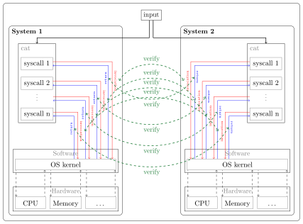

# Securing Process Execution by Recording and Replaying the Inner Process State (SPERRIPS) 

This implementation is part of a master's thesis to research the feasibility of an approach for verifying application execution across two different systems.  
The following figure illustrates the approach's principle.



It operates on the abstraction level of system calls in two phases, similar to recording/replaying systems for deterministic program execution.
The first phase traces each executed syscall of the target application and obtains the syscalls’ argument values.
In the second phase, it compares the recorded values to the actual ones from the re-executed application on a different system and thus verifies the equality of the executions.
In contrast to recording/replaying systems, our approach explicitly re-executes each syscall in the second phase to produce the same side-effects in the kernel as in the first phase for comparing both invocations and results.
Just replaying is explicitly not desired and happens only on acceptable differences. Definitions of acceptable and unacceptable differences are given for syscalls leveraged by the cat application as a proof-of-concept.

## Usage

After [compilation](#compilation) it expects a `config.json` file in the same directory as the `./sperrips` executable.
The json config file specifies the paramets of the sperrips application.

The file format is as follows:

```json
{
    "recording": true,
    "command": "cat",
    "lax_policy": true,
    "commands": {
        "echo": { "args": ["/usr/bin/echo", "/etc/hostname"], "is_hex": false, "stdin": "" },
        "cat": { "args": ["/usr/bin/cat"], "is_hex": false, "stdin": "Hello World! This is input from stdin!" }
    },
    "container": {
        "enable_container": true,
        "mount_point": "/mnt",
        "ol_lowerdir": "/root/bullseye/",
        "ol_upperdir": "/root/deb_diff/",
        "ol_workdir": "/root/deb_work/"
    },
    "workdir": "/root/",
    "stdout_file": "output.log",
    "stderr_file": "output.log",
    "verbosity": 1
}
```

- `recording`: specifies wether sperrips operates in recording or replaying mode. Can be overwritten with `--recording` or `--replaying` command-line arguments.
- `command`: specifies which of the defined `commands` should be executed. **Note**: This name needs to be identical in the recordin/replaying phase on both systems.
- `lax_policy`: specifies wether a lax policy is used (force replaying all differences) or strict, which ensure the polices as defined in the work.
- `commands`: available commands to execute. Each command is identified by a name (e.g., `cat`) and the command-line arguments to run the application. This includes the path and possible arguments. `stdin` input can be encoded as hexadecimal values. However, this requires `is_hex` to be set to `true`.
- `container`: options for the created containerized environment.
    - `enable_container` enable / disable containerized environment
    - `mount_point`: path where to mount the overlay file system
    - `ol_*`:  relate to the created **o**ver**l**ay file system respectively. Lower dir contains [a bootstrapped file system](#bootstrap), e.g., via `debootstrap`.
- `workdir`: work dir of the tracer. If `enable_container` is set to `true`, `workdir` is a container path.
- `stdout_file`: path to redirect the tracee's `stderr`.
- `stderr_file`: path to redirect the tracee's `stderr`.
- `verbosity`: verbosity level of outputs


## Example

Configure the correct paths in the configuration files on both systems. Make sure that the jobnames (`command`) are equal on both systems. For the container, you might need to install a system environment via `debootstrap`.

Then, on System 1 run:

`./sperrips --recording`

Now transfer the `recording.bin` file from System 1 to `workdir` of System 2. `sperrips` outputs the path of the written file.

Then, on System 2 run:

`./sperrips --replaying`


# Info and Dependencies

This project requires a Linux system with kernel 5.3 or newer with `overlayfs` support.
It is written in C++17 and developed and tested on a Ubuntu 20.04 with the following dependencies.

```bash
sudo apt install -y libprotobuf-dev protobuf-compiler make build-essential debootstrap git
```

```bash
$ g++ --version
g++ (Ubuntu 9.3.0-17ubuntu1~20.04) 9.3.0

$ protoc --version
libprotoc 3.6.1
```

<a name="bootstrap"></a>The containerized environment is bootstrapped via `debootstrap bullseye bullseye`.

To inspect the content of the `recording.bin` and `differences.bin` files, use the `code/utils/protoPrint.py` script.
It has the following dependencies:

```bash
apt install python3-pip
pip3 install --user protobuf
```

# <a name="compilation"></a> Compilation
Change into the `code` directory and run the make file by executing `make -j $(nproc)`.
On success `./sperrips` is build and the build artifacts are stored in `bin/`.

# Source code

The code is formatted with `astyle` with the following arguments `astyle -A2 -p -f -UH -k1 -n` and is annotted in doxygen syntax.
Command for formatting all files:

```bash
find . -type f -and \( -name "*.cpp" -or -name "*.h" \) -exec astyle -A2 -p -f -UH -k1 -n "{}" \;
```

## Development

This section lists some commands that ease development.

```
pip3 install -r code/tests/requirements.txt
sudo apt install auditd # Includes ausyscall to dump syscall numbers
ausyscall --dump | sed 1,1d | awk '{ print toupper($2) "\t = " $1";"}' > res/syscalls.txt
```

## Containerized environment: `unshare` & `pivot_root`

Manual entering the containerized environment is possible by

```bash
sudo unshare -m bash
mount -t overlay -o "lowerdir=/root/bullseye/,upperdir=/root/deb_diff,workdir=/root/deb_work/" overlayfs /mnt/
pivot_root /mnt/ /mnt/mnt/
```

# Used libraries

- [magic_enum by Neargye](https://github.com/Neargye/magic_enum)
- [json by nlohmann](https://github.com/nlohmann/json)
- [protobuf by Google](https://github.com/google/protobuf)

# Repository structure

```
.
├── code: The code of the implementation.
├── evaluation: The raw files of both evaluation scenarios.
└── modifications: Patch files of the applied modifications.
```
